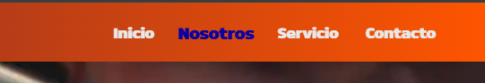
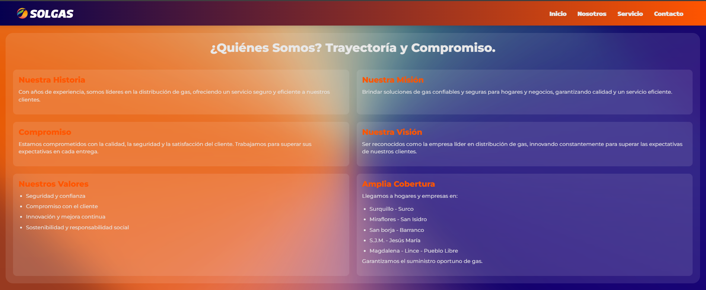
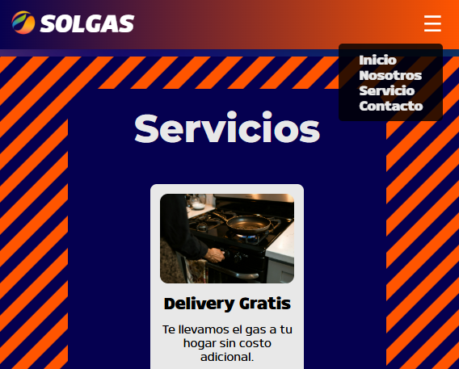

# 🚀 Sitio Web Solgas - Distribuidor Autorizado de Gas

 *(Reemplaza con una imagen real del proyecto)*

**Sitio web estático** para un distribuidor autorizado de balones de gas en Lima, Perú. Diseñado con enfoque en usabilidad, animaciones interactivas y diseño responsivo.

🔗 [Demo en Vivo](https://tu-usuario.github.io/solgas-website) | 📂 [Repositorio](https://github.com/tu-usuario/solgas-website)

---

## ✨ Características Principales
- ✅ **Diseño Moderno**: Gradientes dinámicos y paleta de colores corporativos.
- 📱 **Responsive**: Adaptable a móviles, tablets y desktop.
- 🎥 **Video de Fondo**: Sección hero con video autoplay para impacto visual.
- 🚫 **Menú Hamburguesa**: Navegación optimizada para móviles.
- ✨ **Animaciones GSAP**: Efectos suaves al hacer scroll.
- 🏷️ **SEO Básico**: Metaetiquetas para descripción y keywords.

---

## 🛠️ Tecnologías Utilizadas
| Frontend           | Herramientas          |
|--------------------|-----------------------|
| HTML5              | GSAP (Animaciones)    |
| CSS3 (Grid/Flexbox)| ScrollTrigger         |
| JavaScript         | Git & GitHub          |

---

## 🖼️ Capturas de Pantalla
| Sección Hero | Sección Nosotros |
|--------------|------------------|
|  |  |

| Sección Servicios | Mobile View |
|-------------------|-------------|
|  |  |

---
